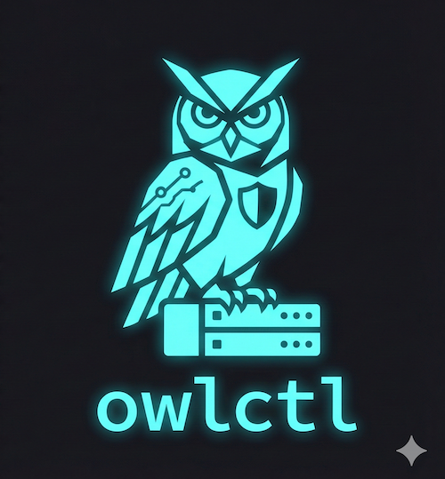

<div align="center">
  
  <h1>owlctl</h1>
  <p><strong>vcli is now owlctl</strong> — same tool, new name. If you're upgrading, see the <a href="docs/migration-vcli-to-owlctl.md">migration guide</a>.</p>
</div>


**Formatting provided by [Nushell.](https://www.nushell.sh/)** owlctl only gets the data!

See the [User guide](https://github.com/shapedthought/owlctl/blob/master/user_guide.md) for more information.

NOTE:

- This is not an official Veeam tool and is provided under the MIT license.
- This tool is still in development so there maybe breaking changes in the future.

## What is owlctl?

A cross-platform CLI tool for managing Veeam infrastructure through APIs. Works with VBR, Enterprise Manager, VB365, VONE, and VB for AWS/Azure/GCP.

**Two modes:**
- **Imperative** - Direct API operations (GET/POST/PUT) for all Veeam products
- **Declarative** - Infrastructure-as-code with drift detection for VBR (jobs, repositories, SOBRs, encryption, KMS)

## Why owlctl?

- **Simple setup** - Single binary, no dependencies, works anywhere
- **Handles authentication** - OAuth, Basic Auth, session management built-in
- **GitOps ready** - Export configs to YAML, track in Git, detect drift, auto-remediate
- **Multi-environment** - Configuration overlays for dev/staging/prod
- **Security-focused** - Drift detection with CRITICAL/WARNING/INFO severity classification

Perfect for automating Veeam products without native CLIs (AWS/Azure/GCP) or adding GitOps workflows to VBR.

## Table of Contents

- [Quick Start](#quick-start)
- [Detailed Documentation](#detailed-documentation)
  - [Declarative Job Management](#declarative-job-management-vbr)
  - [State Management & Drift Detection](#state-management--drift-detection)
- [Installing](#installing-)
- [Compiling from Source](#compiling-from-source)
- [Docker](#docker-)
- [Why Go?](#why-go)
- [Contribution](#contribution-)
- [Issues and Comments](#issues-and-comments-)
- [Change Log](#change-log-)

## Quick Start

### 1. Install

Download the binary for your platform from [Releases](https://github.com/shapedthought/owlctl/releases) and verify the checksum:

```bash
# Windows
Get-FileHash -Path owlctl.exe -Algorithm SHA256

# macOS/Linux
shasum -a 256 owlctl  # or: sha256sum owlctl
```

### 2. Initialize and Login

```bash
# Create config files
./owlctl init

# Set credentials
export OWLCTL_USERNAME="administrator"
export OWLCTL_PASSWORD="your-password"
export OWLCTL_URL="vbr.example.com"

# Set profile (select Veeam product)
./owlctl profile --set vbr

# Authenticate
./owlctl login
```

### 3. Choose Your Workflow

**Imperative Mode** (quick API operations):
```bash
./owlctl get jobs
./owlctl post jobs/<id>/start
```

**Declarative Mode** (infrastructure-as-code for VBR):
```bash
# Export existing configuration
./owlctl export <job-id> -o my-job.yaml

# Apply configuration
./owlctl job apply my-job.yaml --dry-run

# Detect drift
./owlctl job diff --all --security-only
```

📖 **Next steps:** [User Guide](user_guide.md) | [GitOps Workflows](docs/gitops-workflows.md) | [Drift Detection](docs/drift-detection.md) | [Azure DevOps Integration](docs/azure-devops-integration.md)

## Detailed Documentation

### Declarative Job Management (VBR)

owlctl supports declarative infrastructure management for VBR backup jobs with **configuration overlays** for multi-environment deployments, enabling GitOps workflows and version control.

#### Quick Start

**1. Export existing job to YAML (full configuration):**
```bash
owlctl export <job-id> -o my-backup.yaml
# Exports complete job with all 300+ VBR API fields
```

**2. Create environment-specific overlays:**
```yaml
# base-backup.yaml - Common configuration
apiVersion: owlctl.veeam.com/v1
kind: VBRJob
metadata:
  name: database-backup
  labels:
    app: database
spec:
  type: VSphereBackup
  repository: default-repo
  storage:
    compression: Optimal
    retention:
      type: Days
      quantity: 7
  objects:
    - type: VirtualMachine
      name: db-server

# prod-overlay.yaml - Production overrides
apiVersion: owlctl.veeam.com/v1
kind: VBRJob
metadata:
  labels:
    env: production
spec:
  description: "Production database backup (30-day retention)"
  repository: prod-repo
  storage:
    retention:
      quantity: 30
  schedule:
    daily: "02:00"

# dev-overlay.yaml - Development overrides
apiVersion: owlctl.veeam.com/v1
kind: VBRJob
metadata:
  labels:
    env: development
spec:
  description: "Development database backup (3-day retention)"
  repository: dev-repo
  storage:
    retention:
      quantity: 3
  schedule:
    daily: "23:00"
```

**3. Preview merged configuration:**
```bash
# Preview production configuration
owlctl job plan base-backup.yaml -o prod-overlay.yaml

# Preview development configuration
owlctl job plan base-backup.yaml -o dev-overlay.yaml

# Show full merged YAML
owlctl job plan base-backup.yaml -o prod-overlay.yaml --show-yaml
```

**4. Apply configuration (dry-run mode):**
```bash
# Preview what would be applied
owlctl job apply base-backup.yaml -o prod-overlay.yaml --dry-run

# Apply when ready
owlctl job apply base-backup.yaml -o prod-overlay.yaml
```

**5. Configure environments (optional):**
```yaml
# owlctl.yaml - Environment configuration
currentEnvironment: production
defaultOverlayDir: ./overlays
environments:
  production:
    overlay: prod-overlay.yaml
    profile: vbr-prod
  development:
    overlay: dev-overlay.yaml
    profile: vbr-dev
```

Then simply:
```bash
owlctl job plan base-backup.yaml  # Uses production overlay automatically
owlctl job apply base-backup.yaml --env development  # Use specific environment
```

#### Key Benefits

- **Multi-Environment Support**: Single base config with environment-specific overlays
- **DRY Configuration**: Define common settings once, override only what differs
- **Strategic Merge**: Deep merge preserves base values while applying overrides
- **Version Control**: Track job configurations in Git
- **GitOps Ready**: Automated deployments via CI/CD
- **Rich Previews**: See merged configurations before applying
- **Environment Awareness**: owlctl.yaml manages environment-specific settings
- **Full API Fidelity**: Export captures all 300+ VBR API fields

#### Workflow Examples

**Single Environment Workflow:**
```bash
# Export existing job
owlctl export <job-id> -o prod-backup.yaml

# Make changes to YAML file
vim prod-backup.yaml

# Preview changes
owlctl job plan prod-backup.yaml

# Apply if satisfied
owlctl job apply prod-backup.yaml --dry-run

# Commit to version control
git add prod-backup.yaml
git commit -m "Update backup schedule"
git push
```

**Multi-Environment Workflow:**
```bash
# 1. Create base template and overlays
mkdir -p configs/overlays
owlctl export <job-id> -o configs/base-backup.yaml

# 2. Create environment overlays
cat > configs/overlays/prod.yaml <<EOF
spec:
  storage:
    retention:
      quantity: 30
  schedule:
    daily: "02:00"
EOF

cat > configs/overlays/dev.yaml <<EOF
spec:
  storage:
    retention:
      quantity: 3
  schedule:
    daily: "23:00"
EOF

# 3. Configure environments
cat > owlctl.yaml <<EOF
currentEnvironment: production
defaultOverlayDir: ./configs/overlays
environments:
  production:
    overlay: prod.yaml
  development:
    overlay: dev.yaml
EOF

# 4. Preview and apply
owlctl job plan configs/base-backup.yaml  # Uses prod overlay (currentEnvironment)
owlctl job plan configs/base-backup.yaml --env development  # Preview dev

# 5. Commit everything
git add configs/ owlctl.yaml
git commit -m "Add multi-environment backup configuration"
git push

# 6. Deploy to different environments
owlctl job apply configs/base-backup.yaml --env production
owlctl job apply configs/base-backup.yaml --env development
```

#### Commands Reference

| Command | Description | Example |
|---------|-------------|---------|
| `export <job-id>` | Export job to YAML (full config) | `owlctl export abc-123 -o job.yaml` |
| `export --all` | Export all jobs to directory | `owlctl export --all -d ./configs/` |
| `export --as-overlay` | Export minimal overlay patch | `owlctl export abc-123 --as-overlay --base base.yaml -o overlay.yaml` |
| `export --simplified` | Export minimal format (legacy) | `owlctl export abc-123 -o job.yaml --simplified` |
| `job apply` | Apply configuration with overlay | `owlctl job apply base.yaml -o prod.yaml --dry-run` |
| `job apply --env` | Apply using environment overlay | `owlctl job apply base.yaml --env production` |
| `job plan` | Preview merged configuration | `owlctl job plan base.yaml -o prod.yaml` |
| `job plan --show-yaml` | Show full merged YAML | `owlctl job plan base.yaml -o prod.yaml --show-yaml` |
| `job diff <name>` | Check single job for drift | `owlctl job diff "SQL-Backup-Job"` |
| `job diff --all` | Check all jobs for drift | `owlctl job diff --all` |
| `job diff --security-only` | Show only WARNING+ drifts | `owlctl job diff --all --security-only` |
| `job diff --severity` | Filter by minimum severity | `owlctl job diff --all --severity critical` |
| `repo snapshot` | Snapshot repository config | `owlctl repo snapshot --all` |
| `repo diff` | Detect repository drift | `owlctl repo diff --all` |
| `repo sobr-snapshot` | Snapshot SOBR config | `owlctl repo sobr-snapshot --all` |
| `repo sobr-diff` | Detect SOBR drift | `owlctl repo sobr-diff --all` |
| `encryption snapshot` | Snapshot encryption passwords | `owlctl encryption snapshot --all` |
| `encryption diff` | Detect encryption drift | `owlctl encryption diff --all` |
| `encryption kms-snapshot` | Snapshot KMS servers | `owlctl encryption kms-snapshot --all` |
| `encryption kms-diff` | Detect KMS server drift | `owlctl encryption kms-diff --all` |

**Overlay Resolution Priority:**
1. Explicit `-o/--overlay` flag (highest)
2. `--env` flag (looks up in owlctl.yaml)
3. `currentEnvironment` from owlctl.yaml
4. No overlay (base config only)

### State Management & Drift Detection

owlctl tracks applied configurations in a **state file** and detects when VBR has diverged from the desired state. This covers multiple resource types with security-aware severity classification.

**Supported Resources:**

| Resource | Snapshot | Drift Check |
|----------|----------|-------------|
| Backup Jobs | `owlctl job snapshot --all` | `owlctl job diff --all` |
| Repositories | `owlctl repo snapshot --all` | `owlctl repo diff --all` |
| Scale-Out Repos | `owlctl repo sobr-snapshot --all` | `owlctl repo sobr-diff --all` |
| Encryption | `owlctl encryption snapshot --all` | `owlctl encryption diff --all` |
| KMS Servers | `owlctl encryption kms-snapshot --all` | `owlctl encryption kms-diff --all` |

**Security-Aware Classification:**

Each drift is classified as CRITICAL, WARNING, or INFO based on its security impact. Value-aware rules consider the *direction* of change (e.g., encryption disabled = CRITICAL, enabled = INFO). Cross-resource validation detects when jobs are moved off hardened repositories.

```
$ owlctl job diff "Backup Job 1"
Checking drift for job: Backup Job 1

CRITICAL: 2 security-relevant changes detected

Drift detected:
  CRITICAL ~ isDisabled: false (state) -> true (VBR)
  CRITICAL ~ storage.retentionPolicy.quantity: 3 (state) -> 1 (VBR)
  INFO ~ schedule.runAutomatically: false (state) -> true (VBR)
```

**Severity Filtering:**

```bash
owlctl job diff --all --severity critical    # Only CRITICAL drifts
owlctl job diff --all --security-only        # WARNING and above
```

**Exit Codes for CI/CD:**

| Code | Meaning |
|------|---------|
| `0` | No drift |
| `3` | Drift detected (INFO or WARNING) |
| `4` | Critical security drift detected |
| `1` | Error |

For full details, see:
- [Drift Detection Guide](docs/drift-detection.md)
- [Security Alerting](docs/security-alerting.md)

#### Export as Overlay

Create minimal overlay patches for existing jobs:

**Export full job:**
```bash
owlctl export <job-id> -o full-job.yaml
# Creates 300+ line YAML with all fields
```

**Export as overlay (with base):**
```bash
owlctl export <job-id> --as-overlay --base base-template.yaml -o overlay.yaml
# Creates minimal overlay with only differences
```

**Export as overlay (without base):**
```bash
owlctl export <job-id> --as-overlay -o overlay.yaml
# Extracts commonly changed fields (description, retention, schedule)
```

**Example overlay output:**
```yaml
# VBR Job Overlay
# Base: configs/base-backup.yaml
# Job ID: c07c7ea3-0471-43a6-af57-c03c0d82354a
#
# This overlay contains only the fields that differ from the base.
# Apply with: owlctl job apply base.yaml -o this-file.yaml

apiVersion: owlctl.veeam.com/v1
kind: VBRJob
metadata:
    name: Backup Job 1
spec:
    description: Development Debian backup - 3-day retention
    storage:
        retentionPolicy:
            quantity: 3
    schedule:
        daily:
            localTime: "23:00"
```

**Benefits:**
- Minimal, readable configuration patches
- Easy to review in pull requests
- Reduces Git diff noise
- Focuses on what actually changed

#### Compliance Considerations

**State File is NOT for Audit:**
- Mutable (can be edited/deleted)
- Stored locally on operator's machine
- Not cryptographically signed
- Not append-only

**For Compliance, Use:**
1. **Git Commit History** - Signed commits of YAML files (what was requested)
2. **CI/CD Logs** - GitHub Actions, GitLab CI run logs (who approved, when executed)
3. **VBR Audit Logs** - Immutable VBR audit trail (what actually changed)
4. **PR Approvals** - GitHub PR review/approval records (approval chain)

**State File Purpose:**
- Operational drift detection (did someone change VBR manually?)
- GitOps automation (does VBR match Git?)
- Local development workflow (what did I last apply?)

This is the same model as Terraform - state is operational, audit comes from external systems.

## Installing 🛠️

<b>IMPORTANT The only trusted source of this tool is directly from the release page, or building from source.</b>

<b>Please also check the checksum of the downloaded file before running.</b>

owlctl runs in place without needing to be installed on a computer.

It can be added to your system's path to allow system wide access.

To download please go to the releases tab.

windows

    Get-FileHash -Path <file path> -Algorithm SHA256

Mac

    shasum -a 256 <file path>

Linux - distributions may vary

    sha256sum <file path>

## Compiling from source

If you wish to compile the tool from source, please clone this repo, install Golang, and run the following in the root directory.

Windows:

    go build -o owlctl.exe

Mac/ Linux

    go build -o owlctl

## Docker 🐋

NOTE: at time of writing there will be <b>no official docker image.</b>

To run owlctl in an isolated environment you can use a Docker container.

    docker run --rm -it ubuntu bash

    wget <URL of download>

    ./owlctl init

Persisting the init fils can be done with a bindmount, but note that this does open a potential security hole.

You can of course create your own docker image with owlctl installed which can be built from source.

Example using local git clone:

    FROM golang:1.18 as build

    WORKDIR /usr/src/app

    COPY go.mod go.sum ./

    RUN go mod download && go mod verify

    COPY . .

    RUN go build -v -o /usr/local/bin/owlctl

    FROM ubuntu:latest

    WORKDIR /home/owlctl

    RUN apt-get update && apt-get upgrade -y && apt-get install vim -y

    COPY --from=build /usr/local/bin/owlctl ./

Then exec into the container

    docker run --rm -it YOUR_ACCOUNT/owlctl:0.2 bash

    cd /home/owlctl

    ./owlctl init

With the --rm flag the container will deleted immediately after use.

Even when downloading the owlctl into a Docker container, ensure you check the checksum!

## Why Go?

The main reason for using Go, after careful consideration, was that it compiles to a single binary with all decencies included.

Python was a close second, and is a great language, but some of the complexities of dependency management can make it more difficult to get started.

If anyone knows me I love RUST, but for this decided that Go was a better choice.

If you prefer other languages, feel free to take this implementation as an example and build your own.

## Contribution 🤝

If you think something is missing, or you think you can make it better, feel free to send me a pull request.

## Issues and comments ☝️

If you have any issues or would like to see a feature added please raise an issue.

### Change Log 🪵

| Version     | Changes                                                             |
| ----------- | ------------------------------------------------------------------- |
| 0.1.0-beta1 | First beta                                                          |
| 0.2.0-beta1 | Added ability change settings files location                        |
| 0.3.0-beta1 | Added Enterprise Manager support                                    |
| 0.4.0-beta1 | Added POST command and added new credentials management option      |
| 0.5.0-beta1 | Added Utils and PUT commands                                        |
| 0.6.0-beta1 | Added version check and updated VBR and VB365 to latest the version |
| 0.7.0-beta1 | Added job template feature                                          |
| 0.8.0-beta1 | Bumped API versions in the init command                             |
| 0.9.0-beta1 | **Configuration Overlay System**: Strategic merge engine for multi-environment deployments. Enhanced export (300+ fields), owlctl.yaml environment config, overlay support in apply/plan commands. Deep merge preserves base values. Full GitOps support. |
| 0.10.0-beta1 | **Security Drift Detection**: State management and drift detection for repositories, SOBRs, encryption passwords, and KMS servers. Security severity classification (CRITICAL/WARNING/INFO) for all resource types. Value-aware severity with directional change analysis. Cross-resource hardened repository validation. Customizable severity via severity-config.json. CI/CD-ready exit codes. |
| 0.11.0-beta1 | **Modernized Authentication & Automation**: Non-interactive init, secure token storage (system keychain), profiles.json v1.0 format, credentials from environment variables, profile commands take arguments. Clean break from v0.10.x. See [Migration Guide](docs/migration-v0.10-to-v0.11.md) |
| 0.12.0-beta1 | **Diff Preview & Expanded Severity**: Diff preview in plan/dry-run commands, job snapshot command, expanded severity maps for repos/SOBRs/KMS servers. |
| 0.12.1-beta1 | **Raw JSON Diff**: Fix job diff to use raw JSON instead of typed struct (#89). |
