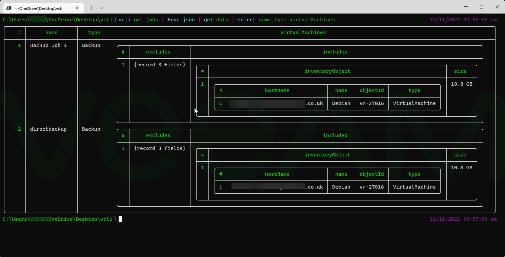

# vcli

**Formatting provided by [Nushell.](https://www.nushell.sh/)** vcli only gets the data!

See the [User guide](https://github.com/shapedthought/vcli/blob/master/user_guide.md) for more information.

NOTE:

- This is not an official Veeam tool and is provided under the MIT license.
- This tool is still in development so there maybe breaking changes in the future.

## What is it?

The vcli is a simple tool to interact with (most) Veeam APIs.

These include:

- VBR
- Enterprise Manager
- VB365
- VONE
- VB for Azure
- VB for AWS
- VB for GCP

You can also add new endpoints by updating the profiles.json file.

## Why?

The main aim here is to make using Veeam APIs more accessible by handling many of the barriers to entry such as authentication.

If you are already a power API user with your own tools, then fantastic, please carry on with what you are doing!

The benefits include:

- simple to install
- simple syntax
- run anywhere
- run on anything

VBR and VB365 have powerful PowerShell cmdlets which I encourage you to use if that is your preference. vcli is not designed as a replacement, just a compliment.

However, products such as VB for AWS/Azure/GCP do not have a command line interface, this is where the vcli can really help.

## Commands

The current commands are:

- login - logs into the API
- get - gets information from the API
- post - sends a post request to the API with optional data payload
- put - sends a put request to the API with payload
- profile - get, list and set the current API profile
- utils - additional tools for working with Veeam APIs

## How to use

Please see the [user guide](https://github.com/shapedthought/vcli/blob/master/user_guide.md) for more information

## Installing 🛠️

<b>IMPORTANT The only trusted source of this tool is directly from the release page, or building from source.</b>

<b>Please also check the checksum of the downloaded file before running.</b>

vcli runs in place without needing to be installed on a computer.

It can be added to your system's path to allow system wide access.

To download please go to the releases tab.

windows

    Get-FileHash -Path <file path> -Algorithm SHA256

Mac

    shasum -a 256 <file path>

Linux - distributions may vary

    sha256sum <file path>

## Compiling from source

If you wish to compile the tool from source, please clone this repo, install Golang, and run the following in the root directory.

Windows:

    go build -o vcli.exe

Mac/ Linux

    go build -o vcli

## Docker 🐋

NOTE: at time of writing there will be <b>no official docker image.</b>

To run vcli in an isolated environment you can use a Docker container.

    docker run --rm -it ubuntu bash

    wget <URL of download>

    ./vcli init

Persisting the init fils can be done with a bindmount, but note that this does open a potential security hole.

You can of course create your own docker image with vcli installed which can be built from source.

Example using local git clone:

    FROM golang:1.18 as build

    WORKDIR /usr/src/app

    COPY go.mod go.sum ./

    RUN go mod download && go mod verify

    COPY . .

    RUN go build -v -o /usr/local/bin/vcli

    FROM ubuntu:latest

    WORKDIR /home/vcli

    RUN apt-get update && apt-get upgrade -y && apt-get install vim -y

    COPY --from=build /usr/local/bin/vcli ./

Then exec into the container

    docker run --rm -it YOUR_ACCOUNT/vcli:0.2 bash

    cd /home/vcli

    ./vcli init

With the --rm flag the container will deleted immediately after use.

Even when downloading the vcli into a Docker container, ensure you check the checksum!

## Why Go?

The main reason for using Go, after careful consideration, was that it compiles to a single binary with all decencies included.

Python was a close second, and is a great language, but some of the complexities of dependency management can make it more difficult to get started.

If anyone knows me I love RUST, but for this decided that Go was a better choice.

If you prefer other languages, feel free to take this implementation as an example and build your own.

## Contribution 🤝

If you think something is missing, or you think you can make it better, feel free to send me a pull request.

## Issues and comments ☝️

If you have any issues or would like to see a feature added please raise an issue.

### Change Log 🪵

| Version     | Changes                                                             |
| ----------- | ------------------------------------------------------------------- |
| 0.1.0-beta1 | First beta                                                          |
| 0.2.0-beta1 | Added ability change settings files location                        |
| 0.3.0-beta1 | Added Enterprise Manager support                                    |
| 0.4.0-beta1 | Added POST command and added new credentials management option      |
| 0.5.0-beta1 | Added Utils and PUT commands                                        |
| 0.6.0-beta1 | Added version check and updated VBR and VB365 to latest the version |
