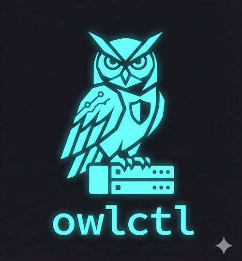
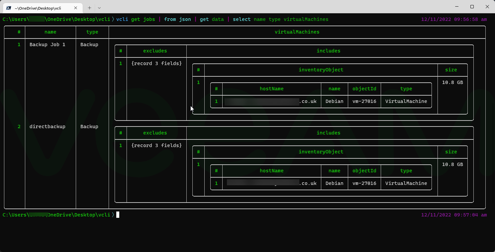

<div align="center">
  
  <h1>owlctl</h1>
  <p><strong>vcli is now owlctl</strong> — same tool, new name. If you're upgrading, see the <a href="docs/migration-vcli-to-owlctl.md">migration guide</a>.</p>
</div>

<p align="center">
  <a href="https://github.com/shapedthought/owlctl/actions/workflows/ci.yml"></a>
  <a href="https://github.com/shapedthought/owlctl/releases/latest"></a>
  <a href="https://github.com/shapedthought/owlctl/blob/master/go.mod"></a>
  <a href="https://goreportcard.com/report/github.com/shapedthought/owlctl"></a>
  <a href="https://github.com/shapedthought/owlctl/blob/master/LICENSE"></a>
  
</p>


**Formatting provided by [Nushell.](https://www.nushell.sh/)** owlctl only gets the data!

See the [User guide](https://github.com/shapedthought/owlctl/blob/master/user_guide.md) for more information.

NOTE:

- This is not an official Veeam tool and is provided under the MIT license.
- This tool is still in development so there maybe breaking changes in the future.

## What is owlctl?

A cross-platform CLI tool for managing Veeam infrastructure through APIs. Works with VBR, Enterprise Manager, VB365, VONE, and VB for AWS/Azure/GCP.

**Two modes:**
- **Imperative** - Direct API operations (GET/POST/PUT) for all Veeam products
- **Declarative** - Infrastructure-as-code with drift detection for VBR (jobs, repositories, SOBRs, encryption, KMS)

## Why owlctl?

- **Simple setup** - Single binary, no dependencies, works anywhere
- **Handles authentication** - OAuth, Basic Auth, session management built-in
- **GitOps ready** - Export configs to YAML, track in Git, detect drift, auto-remediate
- **Multi-environment** - Configuration overlays for dev/staging/prod
- **Security-focused** - Drift detection with CRITICAL/WARNING/INFO severity classification

Perfect for automating Veeam products without native CLIs (AWS/Azure/GCP) or adding GitOps workflows to VBR.

## Table of Contents

- [Quick Start](#quick-start)
- [Documentation](#documentation)
- [Installing](#installing-)
- [Compiling from Source](#compiling-from-source)
- [Docker](#docker-)
- [Why Go?](#why-go)
- [Contribution](#contribution-)
- [Issues and Comments](#issues-and-comments-)
- [Change Log](#change-log-)

## Quick Start

### 1. Install

Download the binary for your platform from [Releases](https://github.com/shapedthought/owlctl/releases) and verify the checksum:

```bash
# Windows
Get-FileHash -Path owlctl.exe -Algorithm SHA256

# macOS/Linux
shasum -a 256 owlctl  # or: sha256sum owlctl
```

### 2. Initialize and Login

```bash
# Create config files
./owlctl init

# Set credentials
export OWLCTL_USERNAME="administrator"
export OWLCTL_PASSWORD="your-password"
export OWLCTL_URL="vbr.example.com"

# Set profile (select Veeam product)
./owlctl profile --set vbr

# Authenticate
./owlctl login
```

### 3. Choose Your Workflow

**Imperative Mode** (quick API operations):
```bash
./owlctl get jobs
./owlctl post jobs/<id>/start
```

**Declarative Mode** (infrastructure-as-code for VBR):
```bash
# Register your VBR server (creates owlctl.yaml)
./owlctl instance add vbr-prod --url vbr-prod.example.com --product vbr
./owlctl instance set vbr-prod

# Export existing configuration to YAML
./owlctl job export <job-id> -o my-job.yaml

# Apply configuration (also saves state for drift detection)
./owlctl job apply my-job.yaml --dry-run
./owlctl job apply my-job.yaml

# Snapshot resources that aren't managed by apply yet
./owlctl repo snapshot --all

# Detect drift against saved state
./owlctl job diff --all --security-only
```

📖 **Next steps:** [Getting Started](docs/getting-started.md) | [State Management](docs/state-management.md) | [GitOps Workflows](docs/gitops-workflows.md) | [Drift Detection](docs/drift-detection.md) | [Azure DevOps Integration](docs/azure-devops-integration.md)

## Documentation

| Guide | Description |
|-------|-------------|
| [Getting Started](docs/getting-started.md) | Installation, setup, first commands — start here |
| [Declarative Mode](docs/declarative-mode.md) | Infrastructure-as-code for VBR: export, apply, overlays, groups, instances |
| [State Management](docs/state-management.md) | How state works, instance scoping, bootstrapping drift detection |
| [Drift Detection](docs/drift-detection.md) | Severity classification, filtering, exit codes |
| [Security Alerting](docs/security-alerting.md) | Value-aware severity reference, cross-resource validation |
| [Imperative Mode](docs/imperative-mode.md) | GET/POST/PUT API operations, output formatting |
| [GitOps Workflows](docs/gitops-workflows.md) | GitHub Actions, Azure DevOps, GitLab CI integration |
| [Azure DevOps Integration](docs/azure-devops-integration.md) | Pipeline templates, scheduled scans, PR validation |
| [Authentication](docs/authentication.md) | Credentials, token storage, multi-product switching |
| [Command Reference](docs/command-reference.md) | Quick reference for all commands and flags |
| [Troubleshooting](docs/troubleshooting.md) | Common issues and fixes |

> **State and compliance:** `state.json` is operational — it enables drift detection but is not an audit log. For compliance, rely on Git commit history, CI/CD run logs, and VBR's own audit trail. This is the same model as Terraform.

## Installing 🛠️

<b>IMPORTANT The only trusted source of this tool is directly from the release page, or building from source.</b>

<b>Please also check the checksum of the downloaded file before running.</b>

owlctl runs in place without needing to be installed on a computer.

It can be added to your system's path to allow system wide access.

To download please go to the releases tab.

windows

    Get-FileHash -Path <file path> -Algorithm SHA256

Mac

    shasum -a 256 <file path>

Linux - distributions may vary

    sha256sum <file path>

## Compiling from source

If you wish to compile the tool from source, please clone this repo, install Golang, and run the following in the root directory.

Windows:

    go build -o owlctl.exe

Mac/ Linux

    go build -o owlctl

## Docker 🐋

NOTE: at time of writing there will be <b>no official docker image.</b>

To run owlctl in an isolated environment you can use a Docker container.

    docker run --rm -it ubuntu bash

    wget <URL of download>

    ./owlctl init

Persisting the init fils can be done with a bindmount, but note that this does open a potential security hole.

You can of course create your own docker image with owlctl installed which can be built from source.

Example using local git clone:

    FROM golang:1.18 as build

    WORKDIR /usr/src/app

    COPY go.mod go.sum ./

    RUN go mod download && go mod verify

    COPY . .

    RUN go build -v -o /usr/local/bin/owlctl

    FROM ubuntu:latest

    WORKDIR /home/owlctl

    RUN apt-get update && apt-get upgrade -y && apt-get install vim -y

    COPY --from=build /usr/local/bin/owlctl ./

Then exec into the container

    docker run --rm -it YOUR_ACCOUNT/owlctl:0.2 bash

    cd /home/owlctl

    ./owlctl init

With the --rm flag the container will deleted immediately after use.

Even when downloading the owlctl into a Docker container, ensure you check the checksum!

## Why Go?

The main reason for using Go, after careful consideration, was that it compiles to a single binary with all decencies included.

Python was a close second, and is a great language, but some of the complexities of dependency management can make it more difficult to get started.

If anyone knows me I love RUST, but for this decided that Go was a better choice.

If you prefer other languages, feel free to take this implementation as an example and build your own.

## Contribution 🤝

If you think something is missing, or you think you can make it better, feel free to send me a pull request.

## Issues and comments ☝️

If you have any issues or would like to see a feature added please raise an issue.

### Change Log 🪵

| Version     | Changes                                                             |
| ----------- | ------------------------------------------------------------------- |
| 0.1.0-beta1 | First beta                                                          |
| 0.2.0-beta1 | Added ability change settings files location                        |
| 0.3.0-beta1 | Added Enterprise Manager support                                    |
| 0.4.0-beta1 | Added POST command and added new credentials management option      |
| 0.5.0-beta1 | Added Utils and PUT commands                                        |
| 0.6.0-beta1 | Added version check and updated VBR and VB365 to latest the version |
| 0.7.0-beta1 | Added job template feature                                          |
| 0.8.0-beta1 | Bumped API versions in the init command                             |
| 0.9.0-beta1 | **Configuration Overlay System**: Strategic merge engine for multi-environment deployments. Enhanced export (300+ fields), owlctl.yaml environment config, overlay support in apply/plan commands. Deep merge preserves base values. Full GitOps support. |
| 0.10.0-beta1 | **Security Drift Detection**: State management and drift detection for repositories, SOBRs, encryption passwords, and KMS servers. Security severity classification (CRITICAL/WARNING/INFO) for all resource types. Value-aware severity with directional change analysis. Cross-resource hardened repository validation. Customizable severity via severity-config.json. CI/CD-ready exit codes. |
| 0.11.0-beta1 | **Modernized Authentication & Automation**: Non-interactive init, secure token storage (system keychain), profiles.json v1.0 format, credentials from environment variables, profile commands take arguments. Clean break from v0.10.x. See [Migration Guide](docs/migration-v0.10-to-v0.11.md) |
| 0.12.0-beta1 | **Diff Preview & Expanded Severity**: Diff preview in plan/dry-run commands, job snapshot command, expanded severity maps for repos/SOBRs/KMS servers. |
| 0.12.1-beta1 | **Raw JSON Diff**: Fix job diff to use raw JSON instead of typed struct (#89). |
| 1.0.0 | **Rebrand: vcli → owlctl**. Renamed binary, env vars (`VCLI_*` → `OWLCTL_*`), config dir (`~/.owlctl`), API version string. First stable release. See [Migration Guide](docs/migration-vcli-to-owlctl.md). |
| 1.1.0 | **Groups, Targets & Profiles** (Epic #96). Group-based batch apply/diff with `--group`, `kind: Profile` and `kind: Overlay` for standardised policy management, named VBR targets with `--target`, extended `--group` to repos/SOBRs/KMS. |
| 1.2.0 | **Multi-Instance & Generic Pipeline**. Named instances with `--instance` for multi-server automation, YAML export for repos/SOBRs/encryption/KMS, generic map-based job pipeline for all job types, improved API error messages, Windows auth fix. |
