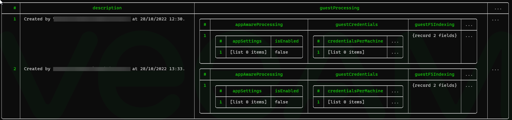

# User Guide

## Init

To start using the app enter:

    ./vcli.exe init

This will create two files:

- settings.json - contains settings that can be adjusted
- profiles.json - profiles of each of the APIs

All future commands will need to be run from the directory where these files reside.

## Profiles

The profiles.json file contains key information for each of the APIs, these mainly differ in terms of Port, and login URL.

The profiles currently are:

- vbr
- vb365
- vone
- aws
- azure
- gcp

To see a list of the profiles run

    ./vcli profile --list / -l

To see the current set profiles run

    ./vcli profiles --get / -g

To set a new profile run

    ./vcli profiles --set / -s

## Log in

Before logging in you will need to set the following environmental variables:

| Name          | Description                                                                        |
| ------------- | ---------------------------------------------------------------------------------- |
| VCLI_USERNAME | The username of the API you are logging into                                       |
| VCLI_PASSWORD | The password of the API you are logging into                                       |
| VCLI_URL      | The address of the API (without the https:// at the start or the :port at the end) |

After doing this and setting the required Profile, you will need to login to the API:

    ./vcli.exe login

If successful it will save a headers.json file which includes the API key that will be used for future calls.

## Commands overview

The tools has also been designed to allow you to output the responses to json and yaml formats. These allow you to then modify these responses using tools such as jq.

However, we have found that pairing vcli with "nu shell" provides an excellent user experience for manipulating API responses.

https://www.nushell.sh/

See the nushell section below.

## Get

With get pass the endpoint that you want to get data from after the API version number. The response is always json unless you pass the --yaml flag.

### Example

To get all managed servers from VBR the full endpoint is:

    /api/v1/backupInfrastructure/managedServers

You would pass the following

    vcli get backupInfrastructure/managedServers

## Using with Nushell

https://www.nushell.sh/

Is designed to work around structured data in a better way that normal shells do so it is ideal for manipulating data from APIs.

Installation: https://www.nushell.sh/book/installation.html

Personally I use chocolatey.

Once installed you just need to enter the command:

    nu

Then if you have vcli installed you can set the environmental variables like so:

    let-env VCLI_USERNAME = "username"
    let-env VCLI_PASSWORD = "password"
    let-env VCLI_URL = "192.168.0.123"

Then login

    vcli login

As vcli prints json to the screen you can simply pipe the output into nushell

    vcli get jobs | from json

As most of the APIs hold the actual data under a "data" object you will need to "get" that data

    vcli get jobs | from json | get data

Nushell has a huge amount of methods to explore, filter and transform you data. One of my favorite is being about to pipe out to a different format.

    vcli get jobs | from json | get data | to yaml

You can also save it in a different format, though you need to use the --raw flag.

    vcli get jobs | from json | get data | to yaml | save jobs.yaml --raw

### Nu Modules

Nushell has its own module system which means you can define a series of methods which can then be brought into the shell's scope.

https://www.nushell.sh/book/modules.html

For example, create a file called v.nu and add the following:

    # v.nu

    export def vget [url: string] {
        vcli get $url | from json | get data
    }

You can then import the module by entering:

    use v.nu

You can then use that module like so:

    v vget jobs

Which does the same as if you did the longer version shown above.

Using modules means that you can easily create complex queries very easily and be able to recall them when needed.

It is also possible add the environmental variables to the module making it even easier to get going.

    #v.nu

    export-env {
        let-env VCLI_USERNAME = "username"
        let-env VCLI_PASSWORD = "password"
        let-env VCLI_URL = "192.168.0.123"
    }

    export def vlogin [] {
        vcli login
    }

    export def vget [url: string] {
        vcli get $url | from json | get data
    }

Nushell has it's own HTTP get and post options, which could be turned into a specific module for Veeam, however, vcli has been designed to do all that already.

There is also a plugin system that Nushell provides which might be something I look at in the future.
